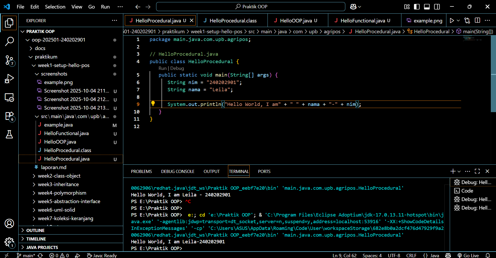

# Laporan Praktikum Minggu 1 (sesuaikan minggu ke berapa?)
Topik: ["Paradigma dan Setup"]

## Identitas
- Nama  : Leila Aristawati
- NIM   : 240202901
- Kelas : 3IKRB

---

## Tujuan
Mahasiswa mampu mendefinisikan paradigma prosedural, OOP, dan fungsional.
Mahasiswa mampu membandingkan kelebihan dan keterbatasan tiap paradigma.
Mahasiswa mampu memberikan contoh program sederhana untuk masing-masing paradigma.
Mahasiswa aktif dalam diskusi kelas (bertanya, menjawab, memberi opini).

---

## Dasar Teori
Tuliskan ringkasan teori singkat (3–5 poin) yang mendasari praktikum.  

Prosedural: program dibangun sebagai rangkaian perintah (fungsi/prosedur).
OOP (Object-Oriented Programming): program dibangun dari objek yang memiliki data (atribut) dan perilaku (method).
Fungsional: program dipandang sebagai pemetaan fungsi matematika, lebih menekankan ekspresi dan transformasi data.
Dalam konteks Agri-POS, OOP membantu memodelkan entitas nyata seperti Produk, Transaksi, dan Pembayaran sebagai objek. Dengan demikian, sistem lebih mudah dikembangkan dan dipelihara.

---

## Langkah Praktikum
1. Setup Project

   Pastikan sudah menginstall JDK (Java Development Kit), IDE (misal: IntelliJ IDEA, VS Code, NetBeans), Git, PostgreSQL, dan JavaFX di komputer.
   Buat folder project oop-pos-<nim>.
   Inisialisasi repositori Git.
   Buat struktur awal src/main/java/com/upb/agripos/.
   Pastikan semua tools dapat berjalan (uji dengan membuat dan menjalankan program Java sederhana).
   Program Sederhana dalam 3 Paradigma

2. Prosedural: program untuk menghitung total harga dua produk.
   OOP: class Produk dengan atribut nama dan harga, buat minimal tiga objek, lalu hitung total.
   Fungsional: gunakan Stream atau lambda untuk menghitung total harga dari minimal tiga objek.
   Commit dan Push

3. Commit dan Push
   Commit dengan pesan: week1-setup-hello-pos.

---

## Kode Program  

1. Procedural
```
  // HelloProcedural.java
public class HelloProcedural {
   public static void main(String[] args) {
      String nim = "240202901";
      String nama = "Leila";
      
      System.out.println("Hello World, I am" + " " + nama + "-" + nim);
   }
```
2. OOP 
```
   // HelloOOP.java
class Mahasiswa {
   String nama;
   String NIM;
   Mahasiswa(String nama, String NIM) {
      this.nama = nama;
      this.NIM = NIM;
   }
   void sapa(){ System.out.println("Hello World, I am" + " " + nama + "-" + NIM);}
}

public class HelloOOP {
   public static void main(String[] args) {
       Mahasiswa m = new Mahasiswa ("Leila", "240202901");
       m.sapa();
   }
}
```
3. Functional
```
   // HelloFunctional.java
import java.util.function.BiConsumer;
public class HelloFunctional {
    public static void main(String[] args) {
        BiConsumer<String,String> sapa =
        (nama, NIM) -> System.out.println("Hello World, I am" + " " + nama + "-" + NIM);
        sapa.accept("Leila", "240202901");
    }
}
```
---

## Hasil Eksekusi
Sertakan screenshot hasil eksekusi program.  
1. 
2. 
3. 

---

## Analisis
- Jelaskan bagaimana kode berjalan.
1. Procedural
   a. Program Java selalu mulai dari metode main().
   b. Dua variabel dibuat:
   c. nim menyimpan "240202901"
   d. nama menyimpan "Leila"
   e. System.out.println(...) mencetak teks ke layar.
   f. Output yang dihasilkan Hello World, I am Leila-240202901

2. OOP
   a. Program tetap mulai dari main() di kelas HelloOOP.
   b. Baris Mahasiswa m = new Mahasiswa("Leila", "240202901");
         Membuat objek baru dari kelas Mahasiswa.
         Konstruktor Mahasiswa(...) dijalankan untuk mengisi nilai nama dan NIM.
   c. Lalu m.sapa();
         Memanggil metode sapa() dari objek m.
         Metode ini mencetak:
            Hello World, I am Leila-240202901

3. Functional
   a. Program tetap mulai dari main().
         BiConsumer<String, String> sapa = ...
         Membuat fungsi anonim (tanpa nama) menggunakan lambda expression.
         BiConsumer artinya fungsi yang menerima dua parameter (String, String) dan tidak mengembalikan nilai.
   b. Baris sapa.accept("Leila", "240202901");
         Memanggil fungsi sapa dan mengisi parameter nama dan NIM.
   c. Fungsi langsung mencetak hasil:
         Hello World, I am Leila-240202901

- Kendala yang dihadapi dan cara mengatasinya.  
   Terjadi eror saat run program. Cara mengatasinya harusnya pada bagian Start Debugging bukan Run Code.

---

## Kesimpulan
(Ketiga pendekatan menghasilkan output yang sama, tetapi berbeda dalam gaya berpikir dan struktur kode.
-Prosedural cocok untuk tugas sederhana.
-OOP cocok untuk sistem besar dan terorganisir.
-Fungsional cocok untuk kode ringkas dan modern berbasis fungsi.)

---

## Quiz
1. [Apakah OOP selalu lebih baik dari prosedural?]  
   **Jawaban:** Tidak selalu. OOP (Object-Oriented Programming) dan prosedural punya kelebihan dan kekurangan masing-masing. OOP lebih baik ketika aplikasi kompleks, butuh representasi objek nyata, perlu reusable code, dan maintainability tinggi. Prosedural lebih baik untuk aplikasi sederhana, skrip kecil, atau program yang sifatnya sekali jalan (one-off script), karena lebih cepat dikembangkan dan lebih ringan. 

2. [Kapan functional programming lebih cocok digunakan dibanding OOP atau prosedural?]  
   **Jawaban:** Functional programming (FP) lebih cocok ketika kita butuh data processing intensif (misalnya big data, machine learning, ETL pipeline). Program harus mudah diuji karena FP mengandalkan fungsi murni (pure function) tanpa efek samping. Perlu parallel/concurrent programming karena FP minim state yang berubah-ubah. Membutuhkan kode deklaratif untuk transformasi data (misalnya dengan map, filter, reduce). 

3. [Bagaimana paradigma (prosedural, OOP, fungsional) memengaruhi maintainability dan scalability aplikasi?]  
   **Jawaban:** Prosedural:mudah dipahami untuk program kecil, tapi ketika aplikasi tumbuh besar, sulit di-maintain karena fungsi-fungsinya bisa saling ketergantungan. Skalabilitas rendah. OOP: lebih mudah maintain karena konsep encapsulation dan modularity. Cocok untuk aplikasi besar dan kompleks. Skalabilitas tinggi. Functional: mudah diuji dan scalable karena kode bebas dari state global. Cocok untuk aplikasi data-driven dan sistem terdistribusi.
4. [Mengapa OOP lebih cocok untuk mengembangkan aplikasi POS dibanding prosedural?]
   **Jawaban:** Karena aplikasi Point of Sale (POS) biasanya memiliki entitas nyata (Produk, Transaksi, Kasir, Pelanggan) yang mudah dimodelkan dengan class/objek. Butuh reusability (misalnya metode hitungTotal() bisa dipakai di banyak tempat). Lebih mudah di-maintain kalau ada penambahan fitur (misalnya menambah modul diskon atau membership). Lebih aman dengan encapsulation (misalnya data transaksi tidak bisa diubah sembarangan).
5. [Bagaimana paradigma fungsional dapat membantu mengurangi kode berulang (boilerplate code)?]
    **Jawaban:** Dengan menggunakan higher-order functions (map, reduce, filter), kita bisa mengganti banyak loop yang berulang. Menghindari penulisan ulang logika dengan pure functions yang reusable.Lebih deklaratif, jadi kita menulis “apa yang dilakukan” daripada “bagaimana cara melakukannya”.
