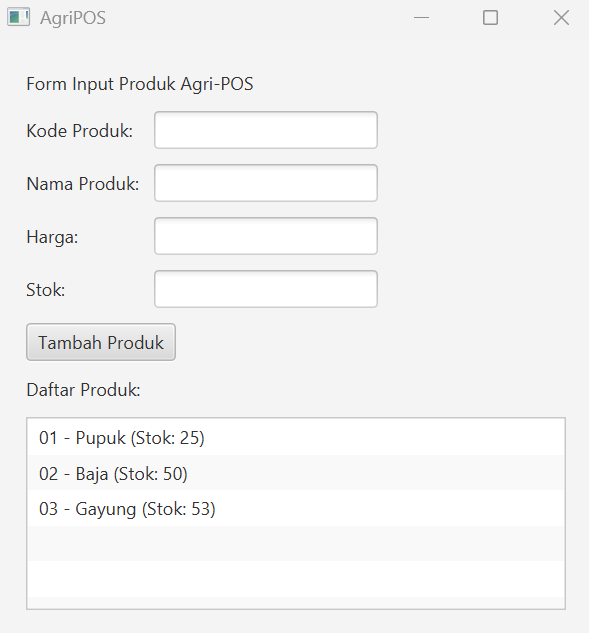

# Laporan Praktikum Minggu 12
Topik: GUI Dasar JavaFX (Event-Driven Programming)

## Identitas
- Nama  : Leila Aristawati
- NIM   : 240202901
- Kelas : 3IKRB

---

## Tujuan
1. Menjelaskan konsep event-driven programming.
2. Membangun antarmuka grafis sederhana menggunakan JavaFX.
3. Membuat form input data produk.
4. Menampilkan daftar produk pada GUI.
5. Mengintegrasikan GUI dengan modul backend yang telah dibuat (DAO & Service).

---

## Dasar Teori   
1. Java adalah bahasa pemrograman berorientasi objek yang bersifat platform independent, artinya program yang dibuat dapat dijalankan di berbagai sistem operasi. Java banyak digunakan untuk pengembangan aplikasi desktop, web, dan mobile karena stabil, aman, serta memiliki pustaka yang lengkap.  
2. JavaFX merupakan framework Java yang digunakan untuk membangun aplikasi GUI (Graphical User Interface). JavaFX menyediakan komponen antarmuka seperti TextField, Button, Label, ListView, serta mendukung pengelolaan event untuk interaksi pengguna. JavaFX digunakan pada aplikasi AgriPOS untuk menampilkan form input produk dan daftar produk secara visual.  
3. MVC adalah pola arsitektur perangkat lunak yang memisahkan aplikasi menjadi tiga bagian utama:
Model: Mengelola data dan logika bisnis (contoh: kelas Product).
View: Menampilkan antarmuka pengguna (contoh: ProductFormView).
Controller: Menghubungkan Model dan View serta menangani aksi pengguna (contoh: ProductController).
Penerapan MVC membuat kode lebih terstruktur, mudah dipelihara, dan mudah dikembangkan.
4. Apache Maven adalah alat bantu build automation yang digunakan untuk mengelola dependensi, struktur proyek, serta proses kompilasi aplikasi Java. Maven memudahkan pengelolaan library seperti JavaFX dan PostgreSQL JDBC Driver pada proyek AgriPOS.
5. PostgreSQL adalah sistem manajemen basis data relasional (Relational Database Management System) yang bersifat open source. PostgreSQL digunakan untuk menyimpan dan mengelola data produk seperti kode produk, nama, harga, dan stok.

---

## Kode Program
## Contoh Event Handling JavaFX
```java
btnAdd.setOnAction(event -> {
	 Product p = new Product(
		  txtCode.getText(),
		  txtName.getText(),
		  Double.parseDouble(txtPrice.getText()),
		  Integer.parseInt(txtStock.getText())
	 );
	 productService.insert(p); // productService mengarah ke DAO
	 listView.getItems().add(p.getCode() + " - " + p.getName());
});
```

## ProductController.java
```java
package com.upb.agripos.controller;

import java.util.List;
import com.upb.agripos.model.Product;
import com.upb.agripos.service.ProductService;
import com.upb.agripos.view.ProductFormView;
import javafx.scene.control.Alert;

public class ProductController {
    private final ProductService service;
    private final ProductFormView view;

    public ProductController(ProductService service, ProductFormView view) throws Exception {
        this.service = service;
        this.view = view;
        initController();
    }

    private void initController() throws Exception {
        // Event Handler untuk tombol Tambah
        view.getBtnAdd().setOnAction(e -> addProduct());
        
        // Load data awal
        loadData();
    }

    private void addProduct() {
        try {
            String code = view.getTxtCode().getText();
            String name = view.getTxtName().getText();
            double price = Double.parseDouble(view.getTxtPrice().getText());
            int stock = Integer.parseInt(view.getTxtStock().getText());

            Product p = new Product(code, name, price, stock);
            service.addProduct(p);
            
            view.clearForm();
            loadData(); // Refresh list
        } catch (NumberFormatException ex) {
            new Alert(Alert.AlertType.ERROR, "Harga dan Stok harus berupa angka!").show();
        } catch (Exception ex) {
            new Alert(Alert.AlertType.ERROR, "Gagal menyimpan: " + ex.getMessage()).show();
        }
    }

    private void loadData() throws Exception {
        view.getListView().getItems().clear();
        List<Product> products = service.getAllProducts();
        for (Product p : products) {
            view.getListView().getItems().add(
                p.getCode() + " - " + p.getName() + " (Stok: " + p.getStock() + ")"
            );
        }
    }
}
```

## ProductService.java
```java
package com.upb.agripos.service;

import java.util.List;

import com.upb.agripos.dao.ProductDAO;
import com.upb.agripos.model.Product;

public class ProductService {
    private final ProductDAO productDAO;

    public ProductService(ProductDAO productDAO) {
        this.productDAO = productDAO;
    }

    public void addProduct(Product product) {
        try {
            productDAO.insert(product);
        } catch (Exception e) {
            throw new RuntimeException("Gagal menambah produk: " + e.getMessage());
        }
    }

    public List<Product> getAllProducts() {
        try {
            return productDAO.findAll();
        } catch (Exception e) {
            throw new RuntimeException("Gagal mengambil data produk: " + e.getMessage());
        }
    }
}
```

## ProductFormView.java
```java
package com.upb.agripos.view;

import javafx.geometry.Insets;
import javafx.scene.control.Button;
import javafx.scene.control.Label;
import javafx.scene.control.ListView;
import javafx.scene.control.TextField;
import javafx.scene.layout.GridPane;
import javafx.scene.layout.VBox;

public class ProductFormView extends VBox {
    private TextField txtCode = new TextField();
    private TextField txtName = new TextField();
    private TextField txtPrice = new TextField();
    private TextField txtStock = new TextField();
    private Button btnAdd = new Button("Tambah Produk");
    private ListView<String> listView = new ListView<>();

    public ProductFormView() {
        setPadding(new Insets(20));
        setSpacing(10);

        // Form Layout
        GridPane grid = new GridPane();
        grid.setHgap(10);
        grid.setVgap(10);

        grid.add(new Label("Kode Produk:"), 0, 0);
        grid.add(txtCode, 1, 0);

        grid.add(new Label("Nama Produk:"), 0, 1);
        grid.add(txtName, 1, 1);

        grid.add(new Label("Harga:"), 0, 2);
        grid.add(txtPrice, 1, 2);

        grid.add(new Label("Stok:"), 0, 3);
        grid.add(txtStock, 1, 3);

        // Add components to VBox
        getChildren().addAll(
            new Label("Form Input Produk Agri-POS"),
            grid,
            btnAdd,
            new Label("Daftar Produk:"),
            listView
        );
    }

    public TextField getTxtCode() { return txtCode; }
    public TextField getTxtName() { return txtName; }
    public TextField getTxtPrice() { return txtPrice; }
    public TextField getTxtStock() { return txtStock; }
    public Button getBtnAdd() { return btnAdd; }
    public ListView<String> getListView() { return listView; }

    public void clearForm() {
        txtCode.clear();
        txtName.clear();
        txtPrice.clear();
        txtStock.clear();
        txtCode.requestFocus();
    }
}
```

## AppJavaFX.java
```java
package com.upb.agripos;

import com.upb.agripos.controller.ProductController;
import com.upb.agripos.dao.ProductDAOImpl;
import com.upb.agripos.service.ProductService;
import com.upb.agripos.view.ProductFormView;
import javafx.application.Application;
import javafx.scene.Scene;
import javafx.stage.Stage;

import java.sql.Connection;
import java.sql.DriverManager;

public class AppJavaFX extends Application {

    @Override
    public void start(Stage stage) throws Exception {

        // Load driver
        Class.forName("org.postgresql.Driver");

        // Koneksi database
        Connection conn = DriverManager.getConnection(
            "jdbc:postgresql://localhost:5432/agripos",
            "postgres",
            "leila230107"
        );

        // Service
        ProductService service =
            new ProductService(new ProductDAOImpl(conn));

        // View (TANPA parameter)
        ProductFormView view = new ProductFormView();

        // Controller (service + view)
        new ProductController(service, view);

        // Scene
        stage.setScene(new Scene(view, 400, 400));
        stage.setTitle("AgriPOS");
        stage.show();
    }

    public static void main(String[] args) {
        launch(args);
    }
}
```

---

## Hasil Eksekusi  

---

## Analisis
- Jelaskan bagaimana kode berjalan.    
**Jawaban:** Aplikasi AgriPOS dijalankan menggunakan JavaFX dengan arsitektur Model–View–Controller (MVC).
Alur kerja program dimulai dari kelas AppJavaFX yang berfungsi sebagai entry point. Pada kelas ini, aplikasi melakukan koneksi ke database PostgreSQL dan menginisialisasi objek DAO, Service, Controller, serta View.
Kelas Model (Product) merepresentasikan data produk yang terdiri dari kode, nama, harga, dan stok.
Kelas DAO (ProductDAOImpl) bertugas melakukan operasi basis data seperti menambah dan mengambil data produk.
Kelas Service (ProductService) menjadi penghubung antara Controller dan DAO, sekaligus tempat penerapan logika bisnis.
Kelas View (ProductFormView) menampilkan antarmuka pengguna berupa form input dan daftar produk.
Kelas Controller (ProductController) menangani interaksi pengguna, seperti aksi tombol Tambah Produk, memproses data dari View, lalu meneruskannya ke Service untuk disimpan ke database dan ditampilkan kembali ke View
- Apa perbedaan pendekatan minggu ini dibanding minggu sebelumnya.  
**Jawaban:** Pada minggu sebelumnya, pengembangan aplikasi masih berfokus pada aplikasi berbasis console dengan alur program yang sederhana dan interaksi pengguna melalui terminal. Struktur kode masih relatif terpusat dan belum memanfaatkan antarmuka grafis.
Pada minggu ini, pendekatan pengembangan aplikasi beralih ke aplikasi berbasis GUI menggunakan JavaFX serta menerapkan arsitektur MVC secara lebih jelas. Selain itu, aplikasi juga telah terintegrasi dengan database PostgreSQL, sehingga data dapat disimpan dan dikelola secara permanen. Pendekatan ini membuat aplikasi lebih interaktif, terstruktur, dan mendekati aplikasi nyata yang digunakan di dunia industri. 
- Kendala yang dihadapi dan cara mengatasinya.  
**Jawaban:** Kesalahan konfigurasi Maven dan JavaFX, seperti plugin JavaFX yang belum terpasang, sehingga aplikasi tidak dapat dijalankan.
Solusi: Menambahkan dependensi JavaFX dan konfigurasi plugin Maven yang sesuai.
Error pada constructor dan pemanggilan method antar kelas, terutama antara Controller dan View.
Solusi: Menyesuaikan pemanggilan objek agar sesuai dengan constructor dan metode yang telah didefinisikan.
Exception yang tidak tertangani pada Service dan DAO, khususnya terkait operasi database.
Solusi: Menambahkan penanganan exception menggunakan try-catch atau deklarasi throws agar proses kompilasi berhasil.
Dengan melakukan pengecekan error secara bertahap dan memperbaiki konfigurasi serta struktur kode, aplikasi akhirnya dapat berjalan dengan baik
---

## Kesimpulan

Berdasarkan hasil praktikum yang telah dilakukan, dapat disimpulkan bahwa pengembangan aplikasi AgriPOS berhasil menerapkan konsep Object Oriented Programming (OOP) dan arsitektur Model–View–Controller (MVC) menggunakan JavaFX sebagai antarmuka grafis. Aplikasi mampu melakukan proses input dan menampilkan data produk secara interaktif serta terintegrasi dengan database PostgreSQL.
Penerapan pemisahan tanggung jawab antara Model, View, Controller, Service, dan DAO membuat kode program menjadi lebih terstruktur, mudah dipahami, serta mudah dikembangkan. Selain itu, penggunaan GUI memberikan pengalaman pengguna yang lebih baik dibandingkan aplikasi berbasis console.
Dengan demikian, praktikum ini memberikan pemahaman yang lebih mendalam mengenai pembuatan aplikasi Java berbasis GUI, pengelolaan database, serta penerapan konsep OOP dalam pengembangan aplikasi yang lebih kompleks dan mendekati kondisi nyata.

---
