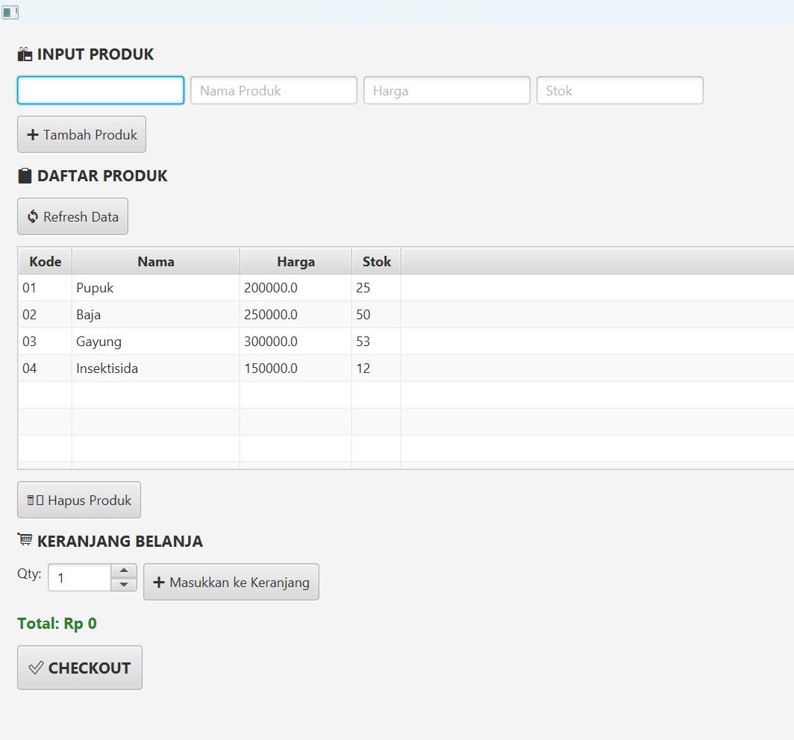
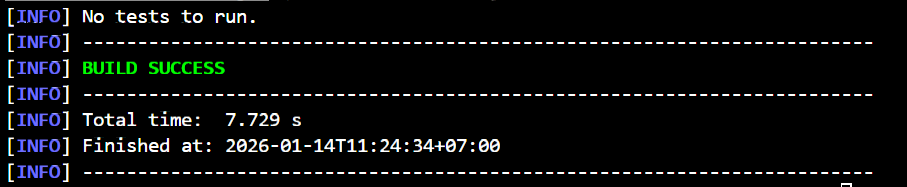

# Laporan Praktikum Minggu 14
Topik: Integrasi Individu (OOP + Database + GUI)

## Identitas
- Nama  : Leila Aristawati
- NIM   : 240202901
- Kelas : 3IKRB

---

## Tujuan
1. Mengintegrasikan konsep OOP (Bab 1–5) ke dalam satu aplikasi yang utuh.
2. Mengimplementasikan rancangan UML + SOLID (Bab 6) menjadi kode nyata.
3. Mengintegrasikan Collections + Keranjang (Bab 7) ke alur aplikasi.
4. Menerapkan exception handling (Bab 9) untuk validasi dan error flow.
5. Menerapkan pattern + unit testing (Bab 10) pada bagian yang relevan.
6. Menghubungkan aplikasi dengan database via DAO + JDBC (Bab 11).
7. Menyajikan aplikasi berbasis JavaFX (Bab 12–13) yang terhubung ke backend.

---

## Dasar Teori
Praktikum Week 14 menggunakan JavaFX untuk membangun aplikasi berbasis GUI dengan menerapkan arsitektur Model–View–Controller (MVC). Pola MVC memisahkan pengelolaan data, tampilan, dan logika aplikasi sehingga sistem lebih terstruktur dan mudah dikembangkan. Akses data dilakukan menggunakan konsep Data Access Object (DAO) yang dihubungkan ke database PostgreSQL melalui JDBC, sementara Service Layer digunakan untuk menangani logika bisnis dan validasi data sebelum diproses. Integrasi seluruh komponen ini menghasilkan aplikasi yang mampu mengelola data produk secara terintegrasi.

---

## Kode Program 

## PosController.java
```java
package com.upb.agripos.controller;

import java.util.List;

import com.upb.agripos.model.CartItem;
import com.upb.agripos.model.Product;
import com.upb.agripos.service.CartService;
import com.upb.agripos.service.ProductService;

public class PosController {

    private final ProductService productService;
    private final CartService cartService;

    public PosController(ProductService ps, CartService cs) {
        this.productService = ps;
        this.cartService = cs;
    }

    public void addProduct(Product p) {
        productService.addProduct(p);
    }

    public void deleteProduct(String code) {
        productService.deleteProduct(code);
    }

    public List<Product> getProducts() {
        return productService.getAllProducts();
    }

    public void addToCart(Product p, int qty) {
        cartService.addToCart(p, qty);
    }

    public void removeFromCart(Product p) {
        cartService.removeFromCart(p);
    }

    public double getCartTotal() {
        return cartService.getTotal();
    }

    public List<CartItem> getCartItems() {
        return cartService.getCartItems();
    }

    public void clearCart() {
        cartService.clearCart();
    }

    public double checkoutCart() {
        return cartService.checkout();
    }
}
```

## ProductService.java
```java
package com.upb.agripos.service;

import java.util.List;

import com.upb.agripos.dao.ProductDAO;
import com.upb.agripos.model.Product;

public class ProductService {
    private final ProductDAO dao;

    public ProductService(ProductDAO dao) {
        this.dao = dao;
        // Load data dari database saat service diinisialisasi
        this.loadFromDatabase();
    }

    private void loadFromDatabase() {
        try {
            List<Product> products = dao.findAll();
            System.out.println("Loaded " + products.size() + " products from database");
        } catch (Exception e) {
            System.err.println("Error loading products from database: " + e.getMessage());
        }
    }

    public void addProduct(Product p) {
        if (p.getCode().isEmpty()) {
            throw new IllegalArgumentException("Kode produk kosong");
        }
        dao.insert(p);
    }

    public void deleteProduct(String code) {
        dao.delete(code);
    }

    public List<Product> getAllProducts() {
        return dao.findAll();
    }
}
```

## PosView.java
```java
package com.upb.agripos.view;

import com.upb.agripos.controller.PosController;
import com.upb.agripos.model.Product;

import javafx.geometry.Insets;
import javafx.scene.control.Alert;
import javafx.scene.control.Button;
import javafx.scene.control.Label;
import javafx.scene.control.Spinner;
import javafx.scene.control.TableColumn;
import javafx.scene.control.TableView;
import javafx.scene.control.TextField;
import javafx.scene.control.cell.PropertyValueFactory;
import javafx.scene.layout.HBox;
import javafx.scene.layout.VBox;

public class PosView extends VBox {

    public PosView(PosController controller) {
        this.setPadding(new Insets(15));
        this.setSpacing(10);

        // ========== SECTION 1: INPUT PRODUK ==========
        Label titleProduct = new Label("📦 INPUT PRODUK");
        titleProduct.setStyle("-fx-font-size: 14; -fx-font-weight: bold;");

        TextField code = new TextField();
        code.setPromptText("Kode Produk");

        TextField name = new TextField();
        name.setPromptText("Nama Produk");

        TextField price = new TextField();
        price.setPromptText("Harga");

        TextField stock = new TextField();
        stock.setPromptText("Stok");

        HBox inputBox = new HBox(5);
        inputBox.getChildren().addAll(code, name, price, stock);

        // ========== SECTION 2: TABEL PRODUK ==========
        Label titleTable = new Label("📋 DAFTAR PRODUK");
        titleTable.setStyle("-fx-font-size: 14; -fx-font-weight: bold;");

        TableView<Product> tableProduct = new TableView<>();
        
        TableColumn<Product, String> colCode = new TableColumn<>("Kode");
        colCode.setCellValueFactory(new PropertyValueFactory<>("code"));
        colCode.setPrefWidth(80);

        TableColumn<Product, String> colName = new TableColumn<>("Nama");
        colName.setCellValueFactory(new PropertyValueFactory<>("name"));
        colName.setPrefWidth(150);

        TableColumn<Product, Double> colPrice = new TableColumn<>("Harga");
        colPrice.setCellValueFactory(new PropertyValueFactory<>("price"));
        colPrice.setPrefWidth(100);

        TableColumn<Product, Integer> colStock = new TableColumn<>("Stok");
        colStock.setCellValueFactory(new PropertyValueFactory<>("stock"));
        colStock.setPrefWidth(80);

        tableProduct.getColumns().addAll(colCode, colName, colPrice, colStock);
        tableProduct.setItems(javafx.collections.FXCollections.observableArrayList(controller.getProducts()));
        tableProduct.setPrefHeight(200);

        // Refresh data dari database
        Button refreshData = new Button("🔄 Refresh Data");
        refreshData.setStyle("-fx-font-size: 12; -fx-padding: 8;");
        refreshData.setOnAction(e -> {
            tableProduct.getItems().setAll(controller.getProducts());
            showAlert("Sukses", "Data berhasil diperbarui!");
        });

        // Button Tambah Produk
        Button add = new Button("➕ Tambah Produk");
        add.setStyle("-fx-font-size: 12; -fx-padding: 8;");
        add.setOnAction(e -> {
            try {
                if (code.getText().isEmpty() || name.getText().isEmpty() || 
                    price.getText().isEmpty() || stock.getText().isEmpty()) {
                    showAlert("Validasi", "Semua field harus diisi!");
                    return;
                }
                controller.addProduct(
                    new Product(
                        code.getText(),
                        name.getText(),
                        Double.parseDouble(price.getText()),
                        Integer.parseInt(stock.getText())
                    )
                );
                code.clear();
                name.clear();
                price.clear();
                stock.clear();
                tableProduct.getItems().setAll(controller.getProducts());
                showAlert("Sukses", "Produk berhasil ditambahkan!");
            } catch (NumberFormatException ex) {
                showAlert("Error", "Harga dan Stok harus berupa angka!");
            }
        });

        // Delete Button
        Button delete = new Button("🗑️ Hapus Produk");
        delete.setStyle("-fx-font-size: 12; -fx-padding: 8;");
        delete.setOnAction(e -> {
            Product selected = tableProduct.getSelectionModel().getSelectedItem();
            if (selected == null) {
                showAlert("Validasi", "Pilih produk yang ingin dihapus!");
                return;
            }
            controller.deleteProduct(selected.getCode());
            tableProduct.getItems().setAll(controller.getProducts());
            showAlert("Sukses", "Produk berhasil dihapus!");
        });

        // ========== SECTION 3: KERANJANG BELANJA ==========
        Label titleCart = new Label("🛒 KERANJANG BELANJA");
        titleCart.setStyle("-fx-font-size: 14; -fx-font-weight: bold;");

        Spinner<Integer> qty = new Spinner<>(1, 1000, 1);
        qty.setPrefWidth(80);

        Button addCart = new Button("➕ Masukkan ke Keranjang");
        addCart.setStyle("-fx-font-size: 12; -fx-padding: 8;");
        addCart.setOnAction(e -> {
            Product selected = tableProduct.getSelectionModel().getSelectedItem();
            if (selected == null) {
                showAlert("Validasi", "Pilih produk dulu!");
                return;
            }
            if (qty.getValue() > selected.getStock()) {
                showAlert("Error", "Stok tidak cukup! Stok tersedia: " + selected.getStock());
                return;
            }
            controller.addToCart(selected, qty.getValue());
            showAlert("Sukses", selected.getName() + " (" + qty.getValue() + "x) ditambahkan ke keranjang");
        });

        HBox cartBox = new HBox(5);
        cartBox.getChildren().addAll(new Label("Qty:"), qty, addCart);

        // ========== SECTION 4: TOTAL & CHECKOUT ==========
        Label totalLabel = new Label("Total: Rp 0");
        totalLabel.setStyle("-fx-font-size: 14; -fx-font-weight: bold; -fx-text-fill: #2E7D32;");

        Button checkout = new Button("✅ CHECKOUT");
        checkout.setStyle("-fx-font-size: 14; -fx-padding: 10; -fx-font-weight: bold;");
        checkout.setOnAction(e -> {
            double total = controller.getCartTotal();
            if (total == 0) {
                showAlert("Validasi", "Keranjang kosong!");
                return;
            }
            showAlert("Pembayaran", "Total yang harus dibayar: Rp " + String.format("%.0f", total));
        });

        // ========== ASSEMBLE UI ==========
        this.getChildren().addAll(
            titleProduct,
            inputBox,
            add,
            titleTable,
            refreshData,
            tableProduct,
            delete,
            titleCart,
            cartBox,
            totalLabel,
            checkout
        );
    }

    private void showAlert(String title, String message) {
        Alert alert = new Alert(Alert.AlertType.INFORMATION);
        alert.setTitle(title);
        alert.setHeaderText(null);
        alert.setContentText(message);
        alert.showAndWait();
    }
}
```

## AppJavafx.java
```java
package com.upb.agripos;

import com.upb.agripos.controller.PosController;
import com.upb.agripos.dao.JdbcProductDAO;
import com.upb.agripos.service.CartService;
import com.upb.agripos.service.ProductService;
import com.upb.agripos.view.PosView;

import javafx.application.Application;
import javafx.scene.Scene;
import javafx.stage.Stage;

public class AppJavaFX extends Application {

    @Override
    public void start(Stage stage) {
        System.out.println("Hello World, I am Leila Aristawati-240202901");

        ProductService ps = new ProductService(JdbcProductDAO.getInstance());
        CartService cs = new CartService();
        PosController controller = new PosController(ps, cs);

        stage.setScene(new Scene(new PosView(controller), 600, 400));
        stage.show();
    }

    public static void main(String[] args) {
        launch();
    }
}
```
## CartServiceTest.java
```java
package com.upb.agripos;

import com.upb.agripos.controller.PosController;
import com.upb.agripos.dao.JdbcProductDAO;
import com.upb.agripos.service.CartService;
import com.upb.agripos.service.ProductService;
import com.upb.agripos.view.PosView;

import javafx.application.Application;
import javafx.scene.Scene;
import javafx.stage.Stage;

public class AppJavaFX extends Application {

    @Override
    public void start(Stage stage) {
        System.out.println("Hello World, I am Leila Aristawati-240202901");

        ProductService ps = new ProductService(JdbcProductDAO.getInstance());
        CartService cs = new CartService();
        PosController controller = new PosController(ps, cs);

        stage.setScene(new Scene(new PosView(controller), 600, 400));
        stage.show();
    }

    public static void main(String[] args) {
        launch();
    }
}
```

---

## Hasil Eksekusi  



---

## Analisis
- Jelaskan bagaimana kode berjalan.  
**jawaban** Aplikasi dijalankan melalui kelas AppJavaFX sebagai entry point JavaFX. Pada tahap ini, koneksi database dibuat menggunakan JDBC dan objek service serta view diinisialisasi. Selanjutnya, ProductController berperan sebagai penghubung antara tampilan (View) dan logika aplikasi (Service).
Ketika pengguna melakukan aksi seperti menambah, menghapus, atau menampilkan data produk, event dari komponen JavaFX akan diproses oleh controller. Controller kemudian memanggil ProductService untuk menjalankan logika bisnis dan berinteraksi dengan ProductDAO dalam mengakses database. Data yang diperoleh selanjutnya dikirim kembali ke view untuk ditampilkan dalam bentuk TableView, sehingga terjadi integrasi antara antarmuka pengguna dan data secara real-time.    
- Apa perbedaan pendekatan minggu ini dibanding minggu sebelumnya.   
**Jawaban** Pada minggu sebelumnya, pengembangan aplikasi masih berfokus pada pembuatan antarmuka pengguna (GUI) dan logika program secara sederhana tanpa integrasi penuh dengan database. Struktur program cenderung lebih langsung dan belum memisahkan tanggung jawab setiap komponen secara jelas.
Pada Week 14, pendekatan pengembangan dilakukan dengan menerapkan arsitektur Model–View–Controller (MVC) dan Service Layer, serta mengintegrasikan aplikasi dengan database menggunakan DAO dan JDBC. Pendekatan ini membuat kode lebih terstruktur, mudah dipelihara, dan mendukung pengembangan aplikasi dalam skala yang lebih besar.   
- Kendala yang dihadapi dan cara mengatasinya.    
**Jawaban** Kendala yang dihadapi pada praktikum ini antara lain error saat proses kompilasi dan runtime, seperti kesalahan pemanggilan kelas, instansiasi interface atau abstract class, serta error event handling pada JavaFX. Selain itu, terdapat kendala dalam menghubungkan aplikasi dengan database PostgreSQL.
Untuk mengatasi permasalahan tersebut, dilakukan pengecekan struktur paket, penyesuaian penggunaan interface dan implementasi yang benar, serta perbaikan logika pada controller agar sesuai dengan pola MVC. Selain itu, konfigurasi koneksi database diperbaiki dan dilakukan proses debugging menggunakan pesan error dari Maven dan JavaFX hingga aplikasi dapat berjalan dengan baik.

---

## Kesimpulan
Berdasarkan praktikum Week 14 yang telah dilakukan, dapat disimpulkan bahwa penerapan JavaFX dengan arsitektur Model–View–Controller (MVC) serta penggunaan DAO dan Service Layer mampu menghasilkan aplikasi yang lebih terstruktur dan terintegrasi dengan database. Pemisahan antara tampilan, logika bisnis, dan pengelolaan data membuat kode program lebih mudah dipahami, dikembangkan, dan dipelihara. Meskipun terdapat beberapa kendala teknis selama proses pengembangan, permasalahan tersebut dapat diatasi melalui debugging dan penyesuaian struktur program. Dengan demikian, praktikum ini memberikan pemahaman yang lebih mendalam mengenai pengembangan aplikasi GUI berbasis Java yang terintegrasi dengan database.

---