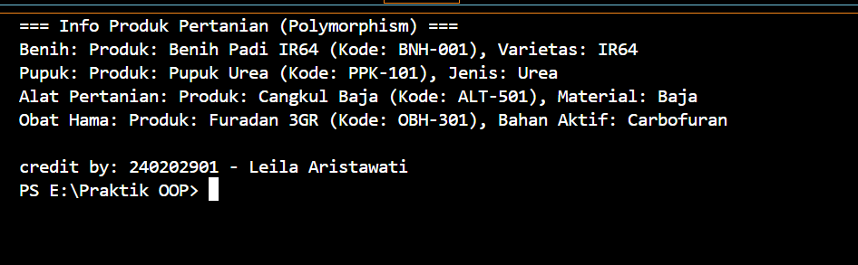

# Laporan Praktikum Minggu 4
Topik: Polymorphism (Info Produk)

## Identitas
- Nama  : Leila Aristawati
- NIM   : 240202901
- Kelas : 3IKRB

---

## Tujuan
- Mahasiswa mampu **menjelaskan konsep polymorphism** dalam OOP.  
- Mahasiswa mampu **membedakan method overloading dan overriding**.  
- Mahasiswa mampu **mengimplementasikan polymorphism (overriding, overloading, dynamic binding)** dalam program.  
- Mahasiswa mampu **menganalisis contoh kasus polymorphism** pada sistem nyata (Agri-POS).
---

## Dasar Teori
Polymorphism berarti “banyak bentuk” dan memungkinkan objek yang berbeda merespons panggilan method yang sama dengan cara yang berbeda.

   1. Overloading → mendefinisikan method dengan nama sama tetapi parameter berbeda.
   2. Overriding → subclass mengganti implementasi method dari superclass.
   3. Dynamic Binding → pemanggilan method ditentukan saat runtime, bukan compile time.
Dalam konteks Agri-POS, misalnya:

   -Method getInfo() pada Produk dioverride oleh Benih, Pupuk, AlatPertanian untuk menampilkan detail spesifik.
   
   -Method tambahStok() bisa dibuat overload dengan parameter berbeda (int, double).

---

## Langkah Praktikum
1. **Overloading**  
   - Tambahkan method `tambahStok(int jumlah)` dan `tambahStok(double jumlah)` pada class `Produk`.  

2. **Overriding**  
   - Tambahkan method `getInfo()` pada superclass `Produk`.  
   - Override method `getInfo()` pada subclass `Benih`, `Pupuk`, dan `AlatPertanian`.  

3. **Dynamic Binding**  
   - Buat array `Produk[] daftarProduk` yang berisi objek `Benih`, `Pupuk`, dan `AlatPertanian`.  
   - Loop array tersebut dan panggil `getInfo()`. Perhatikan bagaimana Java memanggil method sesuai jenis objek aktual.  

4. **Main Class**  
   - Buat `MainPolymorphism.java` untuk mendemonstrasikan overloading, overriding, dan dynamic binding.  

5. **CreditBy**  
   - Tetap panggil `CreditBy.print("<NIM>", "<Nama>")`.  

6. **Commit dan Push**  
   - Commit dengan pesan: `week4-polymorphism`.

---

## Kode Program

### Produk.java (Overloading & getInfo default)  

```java
package com.upb.agripos.model;

public class Produk {
    private String kode;
    private String nama;
    private double harga;
    private int stok;

    public Produk(String kode, String nama, double harga, int stok) {
        this.kode = kode;
        this.nama = nama;
        this.harga = harga;
        this.stok = stok;
    }

    public void tambahStok(int jumlah) {
        this.stok += jumlah;
    }

    public void tambahStok(double jumlah) {
        this.stok += (int) jumlah;
    }


    public String getInfo() {
        return "Produk: " + nama + " (Kode: " + kode + ")";
    }
}
```
### Benih.java (Overriding)

```java
package com.upb.agripos.model;

public class Benih extends Produk {
    private String varietas;

    public Benih(String kode, String nama, double harga, int stok, String varietas) {
        super(kode, nama, harga, stok);
        this.varietas = varietas;
    }

    @Override
    public String getInfo() {
        return "Benih: " + super.getInfo() + ", Varietas: " + varietas;
    }
}
```
### MainPolymorphism.java

```java
package com.upb.agripos;

import com.upb.agripos.model.*;
import com.upb.agripos.util.CreditBy;

public class MainPolymorphism {
    public static void main(String[] args) {
        Produk[] daftarProduk = {
            new Benih("BNH-001", "Benih Padi IR64", 25000, 100, "IR64"),
            new Pupuk("PPK-101", "Pupuk Urea", 350000, 40, "Urea"),
            new AlatPertanian("ALT-501", "Cangkul Baja", 90000, 15, "Baja"),
            new ObatHama("OBH-301", "Furadan 3GR", 50000, 25, "Carbofuran")
        };

        System.out.println("=== Info Produk Pertanian (Polymorphism) ===");
        for (Produk p : daftarProduk) {
            System.out.println(p.getInfo()); // Dynamic Binding
        }

        CreditBy.print("240202901", "Leila Aristawati");
    }
}
```
---

## Hasil Eksekusi  


---
## Analisis
- Jelaskan bagaimana kode berjalan.

   Program membuat beberapa objek produk pertanian (Benih, Pupuk, AlatPertanian, dan ObatHama) yang semuanya turunan dari class Produk. Setiap subclass meng-override method getInfo() agar menampilkan informasi berbeda sesuai jenis produk. Array Produk[] digunakan untuk menyimpan semua objek tersebut, lalu saat p.getInfo() dipanggil di dalam perulangan, Java otomatis memanggil versi method yang sesuai dengan objek aslinya (dynamic binding).
- Apa perbedaan pendekatan minggu ini dibanding minggu sebelumnya. 

   Minggu sebelumnya (Inheritance) fokus pada pewarisan atribut dan method dari superclass ke subclass. Sedangkan minggu ini (Polymorphism) fokus pada perbedaan perilaku antar subclass melalui method overriding dan dynamic binding, meskipun dipanggil dengan tipe referensi yang sama (Produk).
- Kendala yang dihadapi dan cara mengatasinya.

   _
---

## Kesimpulan
Pada praktikum ini, konsep polymorphism berhasil diterapkan dengan menggunakan method overloading dan overriding. Setiap subclass (Benih, Pupuk, AlatPertanian, dan ObatHama) dapat menampilkan informasi berbeda melalui method getInfo(), meskipun semuanya dipanggil menggunakan tipe referensi Produk.Dengan polymorphism, program menjadi lebih fleksibel, efisien, dan mudah dikembangkan karena satu method dapat berperilaku berbeda sesuai objek yang digunakan.

---

## Quiz
1. Apa perbedaan overloading dan overriding?  
   **Jawaban: Overloading terjadi ketika dua atau lebih method memiliki nama yang sama tetapi parameter berbeda (jumlah atau tipe datanya). Sedangkan overriding terjadi ketika subclass membuat ulang (menimpa) method dari superclass dengan isi yang berbeda**

2. Bagaimana Java menentukan method mana yang dipanggil dalam dynamic binding?  
   **Jawaban: Java menentukan method yang dipanggil berdasarkan tipe objek sebenarnya saat runtime, bukan tipe referensinya. Jadi meskipun objek disimpan dalam variabel bertipe Produk, Java tetap memanggil method getInfo() dari subclass yang sesuai** 

3. Berikan contoh kasus polymorphism dalam sistem POS selain produk pertanian.  
   **Jawaban: Contohnya pada sistem POS toko elektronik: class Produk memiliki subclass Laptop, Smartphone, dan Televisi. Masing-masing meng-override method getInfo() untuk menampilkan spesifikasi yang berbeda sesuai jenis produk.** 
