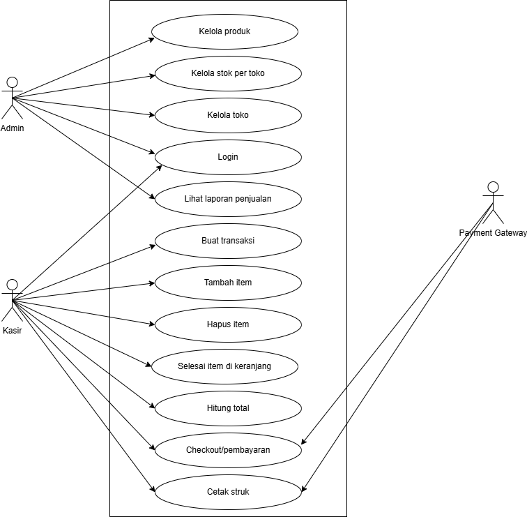
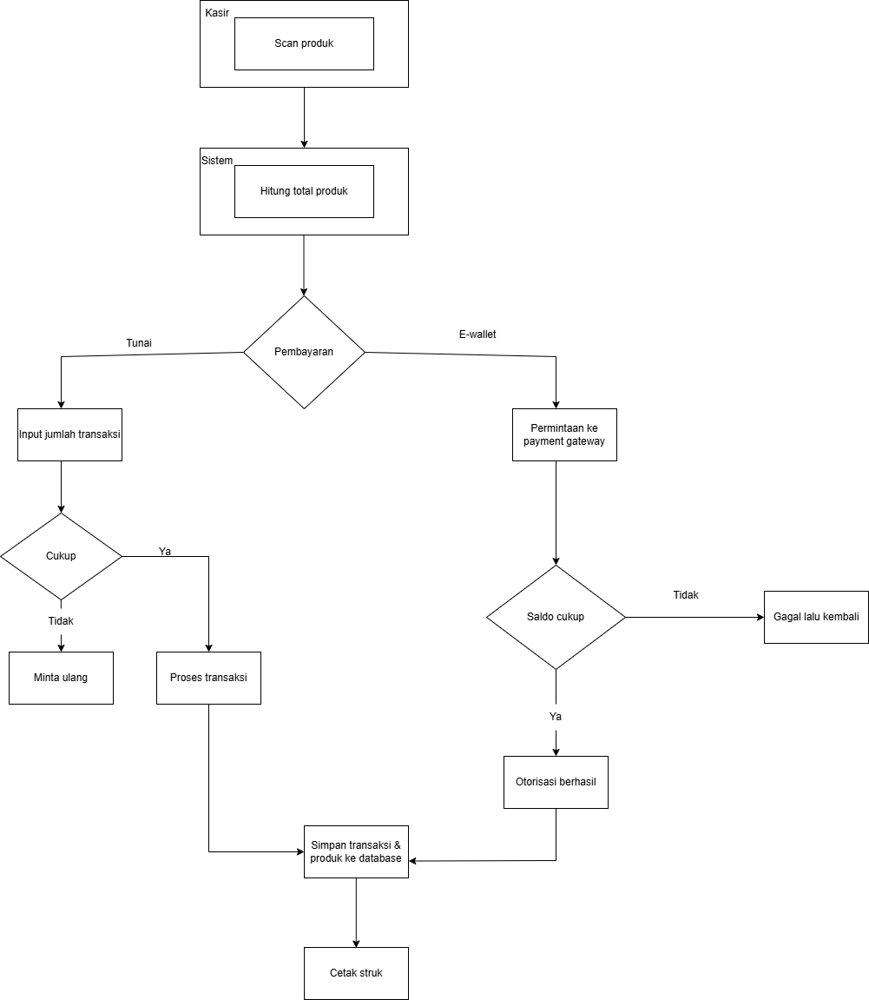
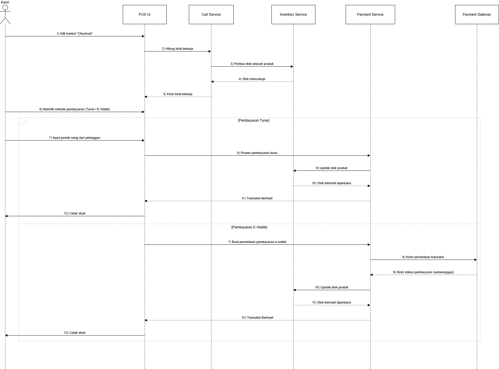
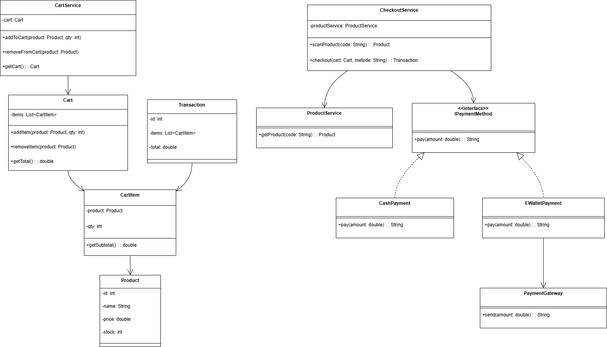

# Laporan Praktikum Minggu 6
Topik: Desain Arsitektur Sistem dengan UML dan Prinsip SOLID

## Identitas
- Nama  : Leila Aristawati
- NIM   : 240202901
- Kelas : 3IKRB

---

## Tujuan

Mahasiswa mampu:

1. Mahasiswa mampu mengidentifikasi kebutuhan sistem ke dalam diagram UML.
2. Mahasiswa mampu menggambar UML Class Diagram dengan relasi antar class yang tepat.
3. Mahasiswa mampu menjelaskan prinsip desain OOP (SOLID).
4. Mahasiswa mampu menerapkan minimal dua prinsip SOLID dalam kode program.

---

## Deskripsi Sistem Agri-POS

Agri-POS adalah sistem Point of Sale (POS) untuk transaksi penjualan produk pertanian seperti benih, pupuk, dan alat pertanian.

Terdapat dua aktor utama:

- **Admin** → mengelola produk dan melihat laporan.
- **Kasir** → melakukan transaksi checkout dan pembayaran.

**Kebutuhan Fungsional (FR) yang dicakup:**

- Kelola produk
- Pemindaian produk
- Checkout dan pembayaran
- Pembayaran tunai & e-wallet
- Cetak struk
- Login pengguna & hak akses

---

## 1. Desain Arsitektur UML

Empat diagram UML disusun untuk menggambarkan struktur dan perilaku sistem.

### 1.1 Use Case Diagram

### Aktor

-   Admin
-   Kasir

### Use Case Utama

-   Login
-   Kelola Produk
-   Scan Produk
-   Checkout
-   Pembayaran (Tunai / E-Wallet)
-   Cetak Struk

### Relasi UML

-   **Include** → Checkout mencakup Cetak Struk\
-   **Generalization** Pembayaran Tunai & Pembayaran E-Wallet

## 1.2 Activity Diagram -- Proses Checkout

Menjelaskan alur kasir ketika memproses transaksi:

1.  Login
2.  Scan Produk
3.  Tambah ke Cart
4.  Pilih Metode Pembayaran
5.  Validasi (Tunai / E-Wallet)
6.  Struk dicetak

Swimlane: Kasir -- Sistem -- Payment Gateway.

## 1.3 Sequence Diagram -- Proses Pembayaran

Interaksi antar objek:

1.  CheckoutService meminta data produk ke ProductService
2.  CheckoutService membuat objek PaymentMethod
3.  Jika E-Wallet → memanggil PaymentGateway
4.  Gateway mengembalikan status
5.  Sistem menyimpan transaksi
6.  Sistem mencetak struk

## 1.4 Class Diagram

Struktur class yang digunakan pada Agri-POS.

### Kelas Domain

-   Product
-   CartItem
-   Cart
-   Transaction

### Kelas Service

-   ProductService
-   CartService
-   CheckoutService

### Kelas Payment

-   IPaymentMethod (interface)
-   CashPayment
-   EWalletPayment
-   PaymentGateway

### Relasi

-   **Composition:** CartItem, Transaction CartItem
-   **Association:** CheckoutService  ProductService
-   **Inheritance:** IPaymentMethod  CashPayment, EWalletPayment
-   **Dependency:** EWalletPayment PaymentGateway

---

# 2. Penerapan Prinsip SOLID

  ------------------------------------------------------------------------
  Prinsip           |     Penjelasan                |     Penerapan
  ------------------ --------------------------- -------------------------
  **SRP**           |     Satu kelas, satu tanggung |     CartService hanya
                    jawab                                 mengelola cart               |

  **OCP**           |     Terbuka untuk ditambah    |     Tambah metode pembayaran
                                                          baru cukup buat class
                                                          baru                         |

  **LSP**           |     Subclass menggantikan     |     CashPayment &
                          parent                          EWalletPayment
                                                          menggantikan
                                                          IPaymentMethod               |

  **ISP**           |     Interface harus spesifik  |     IPaymentMethod hanya
                                                          punya pay()                  |

  **DIP**           |     Bergantung pada abstraksi |     CheckoutService
                                                          bergantung pada
                                                          IPaymentMethod               |

---

# 3. Traceability Matrix

  ---------------------------------------------------------------------------
  FR          |    Use Case          |      Diagram       |         Realisasi          |
  ------------ -------------------- ------------------ ----------------------
  Kelola      |    UC Kelola Produk  |       -             |       ProductService      |
  Produk                                               

  Scan Produk |     UC Scan Produk    |     Sequence       |        ProductService     |

  Checkout    |     UC Checkout       |     Activity       |        CheckoutService,
                                                                  CartService           |

  Pembayaran  |     UC Pembayaran     |     Sequence       |       IPaymentMethod, 
                                                                    CashPayment,
                                                                  EWalletPayment        |

  Cetak Struk |     UC Cetak Struk    |      Sequence       |       Transaction         |

  Login       |     UC Login          |         -           |    AuthService (konsep)  |
 
---

# 4. Quiz

### 1. Jelaskan perbedaan **aggregation** dan **composition** serta berikan contoh penerapannya pada desain Anda.
  -	**Aggregation:** hubungan lemah (Kasir ↔ Store).\
  -	**Composition:** hubungan kuat (Cart → CartItem).

### 2. Bagaimana prinsip **Open/Closed** dapat memastikan sistem mudah dikembangkan?
  Tambah metode pembayaran tanpa edit class lama → cukup tambah implements IPaymentMethod.

### 3. Mengapa **Dependency Inversion Principle (DIP)** meningkatkan **testability**? Berikan contoh penerapannya.
  CheckoutService bisa diuji dengan MockPaymentMethod tanpa PaymentGateway asli.

---

# Kesimpulan
Desain Agri-POS memakai UML dan SOLID sehingga:
-	Memenuhi kebutuhan fungsional

-	Mudah dikembangkan

-	Struktur modular

-	Kuat, aman, dan maintainable

Semua diagram (Use Case, Activity, Sequence, Class) konsisten dan saling mendukung.

---

